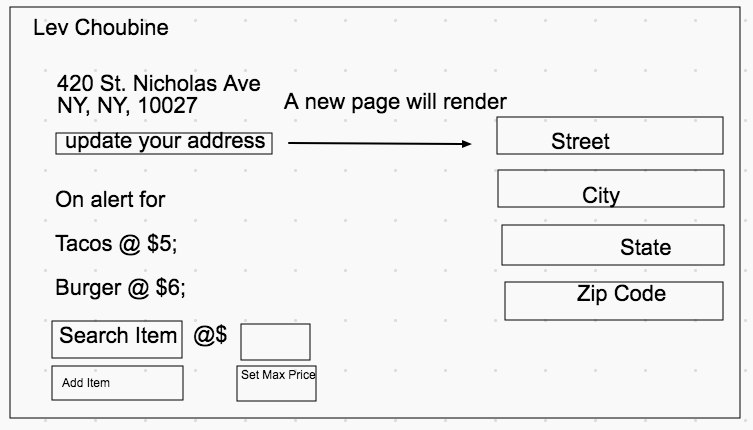
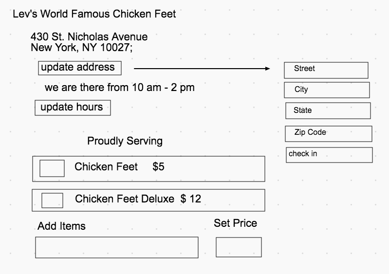
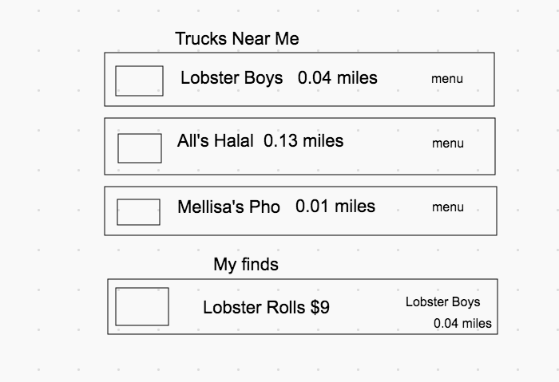
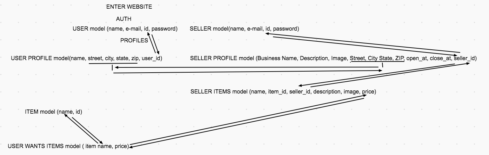

# Project 2 Planning

Fork & Clone this repo.

## Part 1

Review the [Project 2 requirements](https://romebell.gitbook.io/sei-1019/projects/project-2) and check out some [examples](https://tmdarneille.gitbook.io/seirfx/11-projects/past-projects/project2).

In this space below, list **THREE** ideas for your Project 2. For each idea, include [user stories](https://revelry.co/user-stories-that-dont-suck/) for each idea and a link to the API(s) you want to use for it.

--------------------------------------------------------
1. FAMISHED
My idea for the APP is based on Google Maps Distance Matrix API. The API provides distance and travel time between 2 destinations. I want to use the DISTANCE value to reference food trucks within a set range of user’r location. 
We will run 2 tables one for users - one for food trucks. Both will have a location collumn.
Stage One -
The user will get alerts if a food truck registers in their area.We will have food truck register their address once they make a stop. Example: 420 St. Nicholas Avenue 10027. We will store our users locations as well and will find matches once a food truck checks into an area or the user changes their address. (the alert can have a menu attached - a great section you can always expand on).
Stage Two - (user can set parameters for what they are looking for; example Burgers, Price Range $10. The food truck owners can upload their menus into the database to we can match them with user’s preferences once the truck is in the range of the user. 
To me this is enough to start on and everything else is a stretch goal. I want to build a basic food sales app that I can later expand and work on after my course. I am motivated by it’s connection to the real world challenges - it’s hard to order from for trucks online and it would be great to have an app just for that, you could potentially tie this app to the delivery services which would be a huge incentive for truck owners to join and expand their business.
2. 
3.
---------------------------------------------------------

Make a PR when you're done!

---

## Part 2

In the space below:
* either embed or link a completed ERD for your approved P2 idea
* if there are any changes/additions to your user stories, place your full set of revised user stories here
* either embed or link wireframes for every page of your app

----------------------------------------------------------
### Github project steps

[gitHub project outline](https://github.com/lev-choubine/project2-ideas/projects/1?add_cards_query=is%3Aopen)

----------------------------------------------------------
### User Stories

#### User
----------------
1. As a user I want to log in and after setting my location by entering the address find all food trucks within the walking distance. 
2. As a user I want to get alerts when new food trucks are in my area.
3. As a user I want to be able to search through my options for the type of food I want at prices I am in interested in.

##### Vendor
-------------------
As a vendor I want to be able to inform the clientele of the app of my new locations and the  menu items and prices that I offer at the moment.

----------------------------------------------------------
### Wireframes

#### USER PROFILE  

We will list user's address. The user can update it if they go from their house to work and want to get something on their lunch break. 
We are also adding the option to list items the user wants from a drop-down menu with desired price.

#### VENDOR PROFILE  

We will list vendor's adress, which they can update when they change location and hours to make sure the users can only come when the truck is in business. They will have an option to display items on their menu with prices

#### Finds  
 

A page generated for the User to display what is currently available in their are, and Items they want to buy. Congrats!! I found a lobster roll under $10 for lunch!! Sweet! Let me check out that food truck!!

#### Databases

We will be using 7 models to make sure we can execute all aspects of the app  

USERS and SELLERS model for authentication perposes  
USER PROFILE model will store the address of the user to help execute distance calculations between the vendor and the user  
SELLER PROFILE model will store info on the vendor, the hours of operation at the location and location to hel run the distance calculations  

ITEMS model will store types of food avaiable (this will be locked from the users and sellers for now). This will power drop down menus where users and sellers can choose the items they buy or selll - this way when I am looking for Burger I will be referring to the same item and a seller that adds the type to the menu - so I can find it.  

USER WANTS model will store the types of items I might be looking for, and price)  

SELLER ITEMS model will store the seller's offering based on seller_id, and item_type, the vendor will be able to add their short description and images to auto generate a menu

----------------------------------------------------------

Make a PR when you're done!
