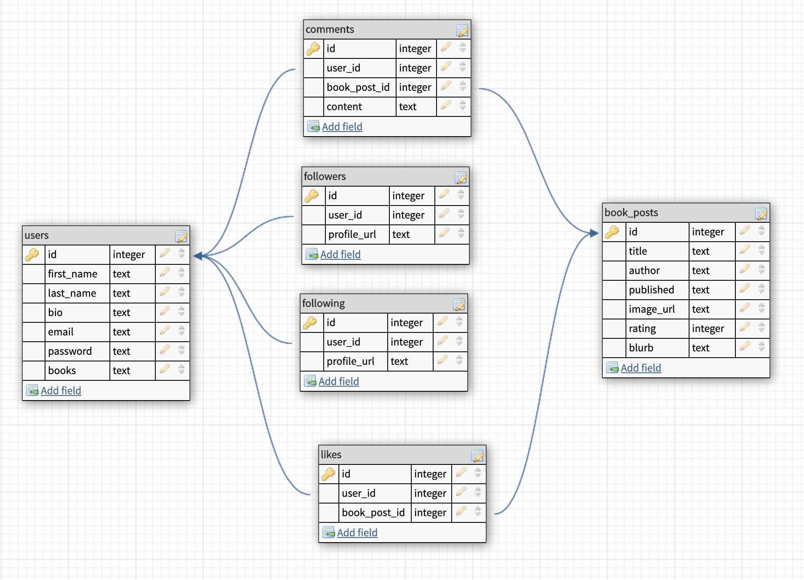
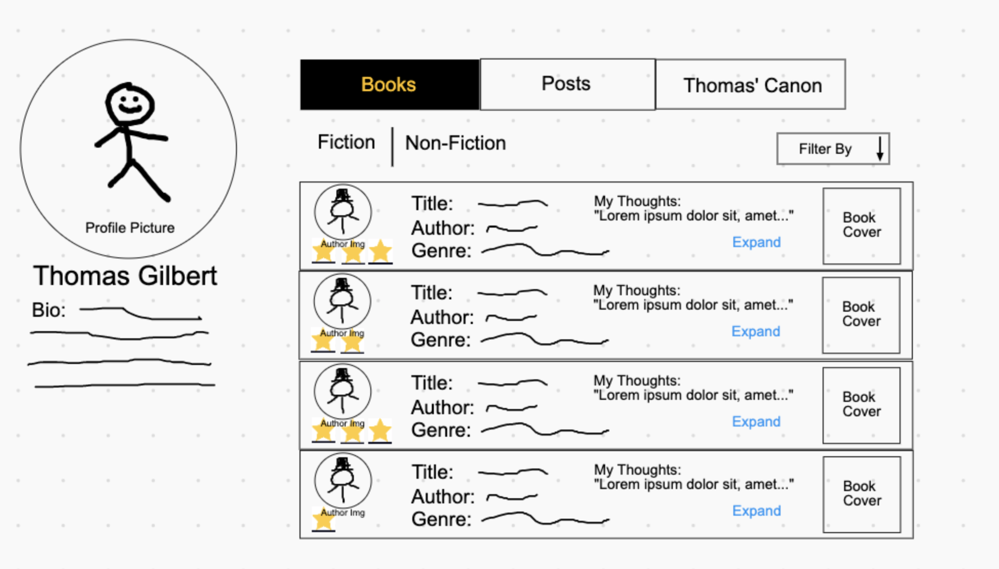

# Project 2 Planning

## Part 1

--------------------------------------------------------
1. Social network for readers
- The bare minimum
    - allow a user to create a page that logs a history of their favorite books
    - formatted in a way that allows one to easily share their favorite books with others
- This idea is similar to something that already exists "goodreads.com" and my goal for this project is to create a sleeker and slimmer version, that focuses on the presentation of the books and the user profile page

- I'll be using the google books api
---------------------------------------------------------

## Part 2

----------------------------------------------------------
### ERD

----------------------------------------------------------
### User Stories
- I want to be able to share a well-organized and presentable profile page of all my favorite books
- I want to be able to rate and review each book
- I want to be able to sort through my books based on rating or category
- I want to be able to follow other friends profiles and see what they are reading 
- I want to be able to comment on other posts
- STRETCH GOALS
    - search a book and be able to see the highest rated post on it
    - share a post formatted for specific social medias: ig story, tweet, etc. 
----------------------------------------------------------
### Wireframes

----------------------------------------------------------

