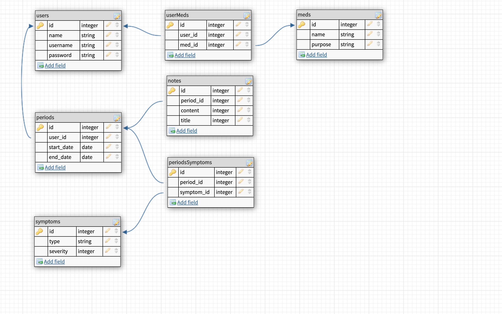
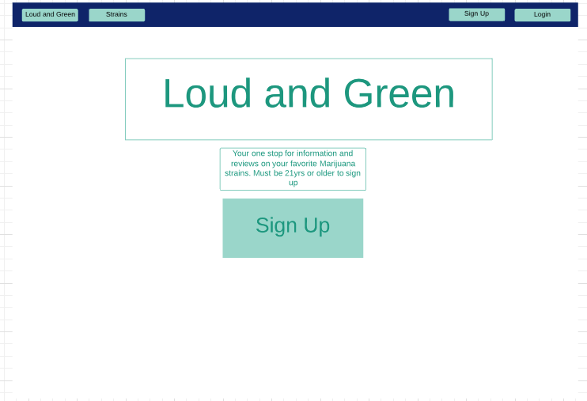
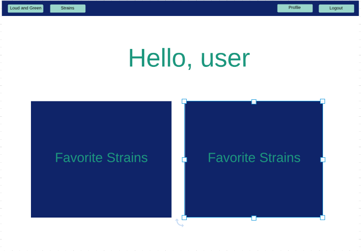
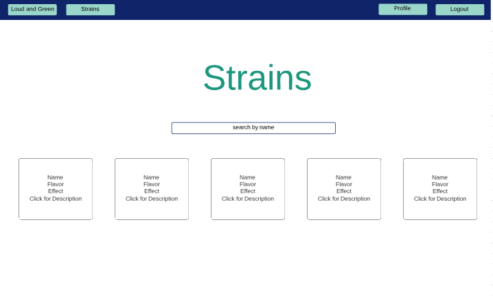
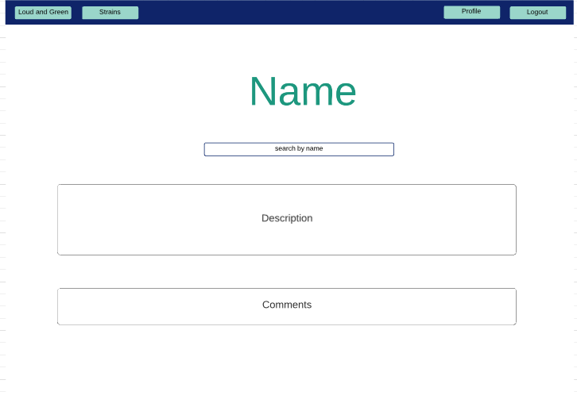

# Project 2 Planning

Fork & Clone this repo.

## Part 1

Review the [Project 2 requirements](https://romebell.gitbook.io/sei-1019/projects/project-2) and check out some [examples](https://tmdarneille.gitbook.io/seirfx/11-projects/past-projects/project2).

In this space below, list **THREE** ideas for your Project 2. For each idea, include [user stories](https://revelry.co/user-stories-that-dont-suck/) for each idea and a link to the API(s) you want to use for it.

--------------------------------------------------------
1. Using strain API, making an app where users can log in look through various marijuana strains and effects and engage on a platform about which ones they enjoy, what kind of effects they've had with the strain(ie: positive or negative)
[strain Api](`https://strainapi.evanbusse.com`)
2. 
3.
---------------------------------------------------------

Make a PR when you're done!

---

## Part 2

In the space below:
* either embed or link a completed ERD for your approved P2 idea
* if there are any changes/additions to your user stories, place your full set of revised user stories here
* either embed or link wireframes for every page of your app

----------------------------------------------------------
### ERD

| Model | Schema | Association |
| ----- | ------ | ----------- |
| User  | id, email, pw |  Has many reviews |
| Profile Page | id, content, user_id, title | belongs to user |
| Reviews/comments | id, content, user_id, name, strain_id, profile_id | belongs to user and strain |
| Strains | id, name, flavor, race, effect | has many comments |
| Description | strain_id, content | belongs to many strains | 

----------------------------------------------------------
### User Stories
- As a user I want to be able to view and save strain information regarding the name, effect, flavor or race of each plant. I would also like to delete any information i have saved from my profile page
- Be able to see detailed descriptions on each strain
- I would like to be able to review strains i have used and comment about my experiences as well others
- Set up my user profile with my favorites and my experiences

----------------------------------------------------------
### Wireframes
- Home Page

- Profile Page

- Strain Page

- Description Page

----------------------------------------------------------

Make a PR when you're done!
