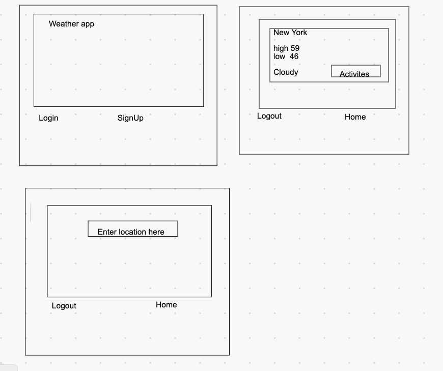

# Project 2 Planning

Fork & Clone this repo.

## Part 1

Review the [Project 2 requirements](https://romebell.gitbook.io/sei-1019/projects/project-2) and check out some [examples](https://tmdarneille.gitbook.io/seirfx/11-projects/past-projects/project2).

In this space below, list **THREE** ideas for your Project 2. For each idea, include [user stories](https://revelry.co/user-stories-that-dont-suck/) for each idea and a link to the API(s) you want to use for it.

--------------------------------------------------------
1. My top idea which I've been thinking about all weekend is buliding a weather app using a third part api. Where each user can save their favorite location or simply just seatch using loction( city/state or city/country).Motivation for doing this is I miss being able to travel. A stretch goal would be to add weather warnings.
https://www.npmjs.com/package/weather
https://openweathermap.org/api

Add some activities a user can do in the area
maybe eventbrite api, yelp, 

2. Build an nba stats application where a user can keep tabs on their favorite players through out the season. With updated stats and fun facts. Also using a third partyapp.
I thought about this as a person that plays fantasy sports. A stretch would be to see if the api could provide breaking news about players.
https://fantasydata.com/api/api-documentation/nba
https://www.npmjs.com/package/nba

3. Not as excited about this one but I did find a currency converter api. The api allows for real time currency converstion that are based on time and date. I have yet to use this one but I have used the weather and sports one in the first 2 ideas.
---------------------------------------------------------

Make a PR when you're done!

---

## Part 2

In the space below:
* either embed or link a completed ERD for your approved P2 idea
* if there are any changes/additions to your user stories, place your full set of revised user stories here
* either embed or link wireframes for every page of your app

----------------------------------------------------------
### ERD

----------------------------------------------------------
### User Stories

User should be able to login and search they're favorite places or constantly get updated weather.

In addition to being able look up their favorite places. THey should be able to see activities they can do in that weather. Or they should be able to get weather warning for inclimate weather.

----------------------------------------------------------
### Wireframes

----------------------------------------------------------

Make a PR when you're done!
